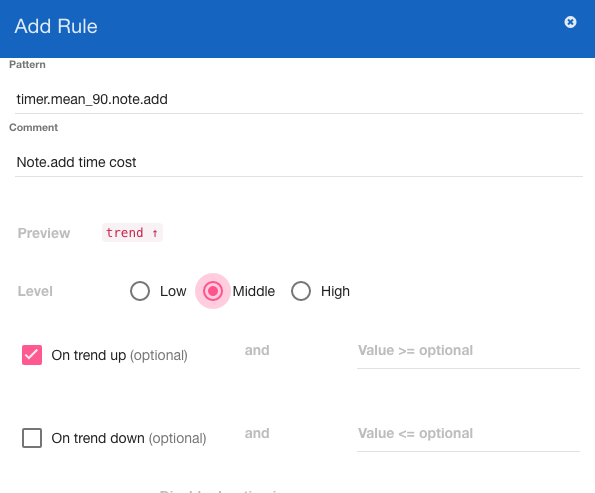
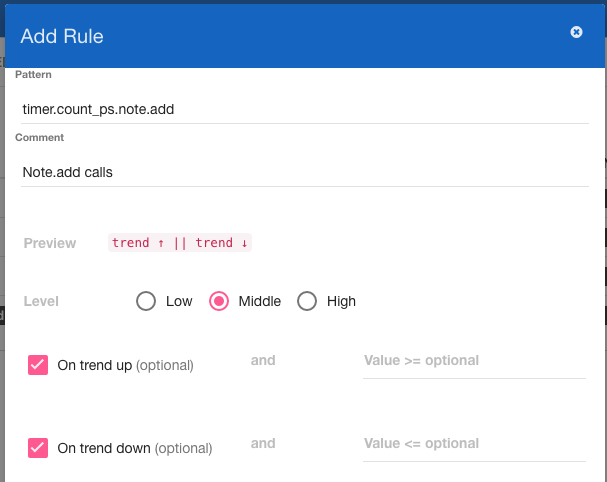
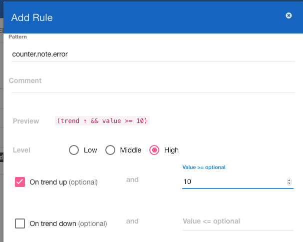
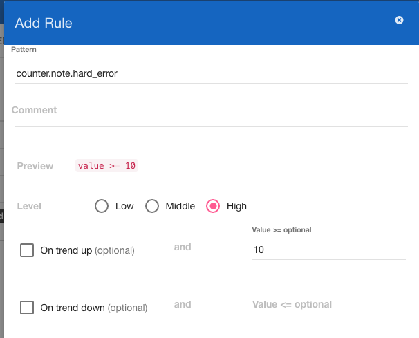
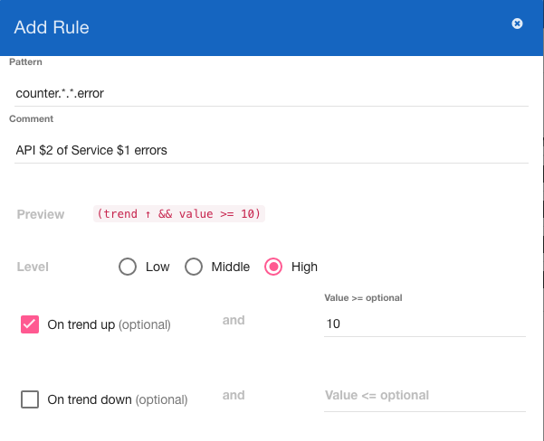
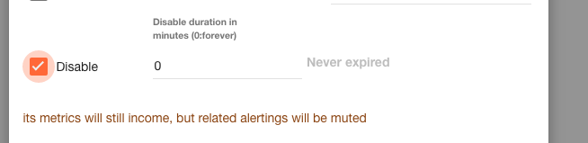
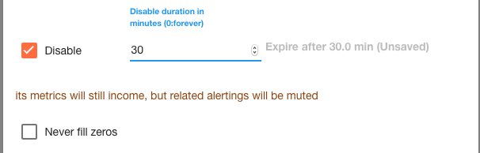
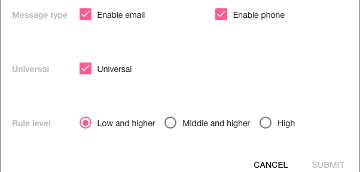
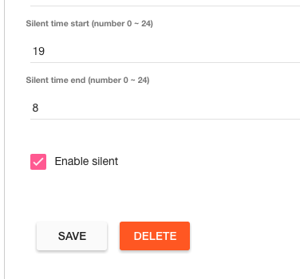

Web Manual
==========

Rule Pattern
------------

Rule pattern is similar to traditional wildcards. Like metric names, there are
delimeted by dots, and only `*` is supported. A single `*` must match a single
word.

```
a.b.c.d.e matches a.*.c.*.e
a.b.c.d.e dose not match a.*
```

Rule Cases
----------

```
[ ] On trend up   AND Value >= ___
OR
[ ] On trend down AND Value <= ___
```

1. `on trend up` => `Alert when trend rises abnormally`.
2. `on trend down` => `Alert when trend drops abnormally`.
3. `value >= X` => `Alert when metric value >= X`.
4. `value <= X` => `Alert when metric value <= X`.
5. `on trend up && value >= X` => `Alert when trend rises abnormally to at least X`.
6. `on trend down && value <= X` => `Alert when trend dorps abnormally to at most X`.
7. `on trend up || on trend down` => `Alert when trend rises or drops abnormally`.
8. `(on trend up && value >= X) || on trend down` => `Alert when trend rises to at least X or drops abnormally`.
9.  And more..

*Setting a fixed threshold to 0 means the rule is unrelated to this threshold.*

Example rule for timers
-----------------------

For a timer, we only care its upward trend, the image below means:
alert when the time cost of `note.add` rises abnormally.



Example rule for count ps
-------------------------

The words "count ps" means "count per second".
For a count_ps, we care its upward and downward trend, the image below
means: alert when the number of calls of `note.add` rises or drops abnormally.



Example rule for counters
-------------------------

For an errors counter, we care its upward trend, the image below means:
alert when the number of errors rises to at least 10.



Example rule for fixed-threshold
--------------------------------

We may want to use simple thresholds but not dynamic trend analyzation, the
image below means: alert when the number of hard errors is greater than 10.



Example rule comment variable matching
--------------------------------------

Comment is required to create or edit a rule. Banshee supports dynamic variable matching
for comments:

```
Rule Pattern: counter.*.*.error
Rule Comment: API $2 of Service $1 errors
Metric Name: counter.note.add.error
Alert Message: API add of Service note errors
```



Example to disable rule
-----------------------

Metrics matching disabled rules are still accepted and analyzed by banshee,
but the alert won't work.

To disable a rule forever:



To disable a rule for a while:



Universal receivers
-------------------

Universal receivers receive alerts from all projects.



Make a project silent
---------------------

By default, the configured silent time range is `[0,6]`, which means
all projects won't alert in `00:00~06:00` by default.

Here is an example to customize this behavior:


