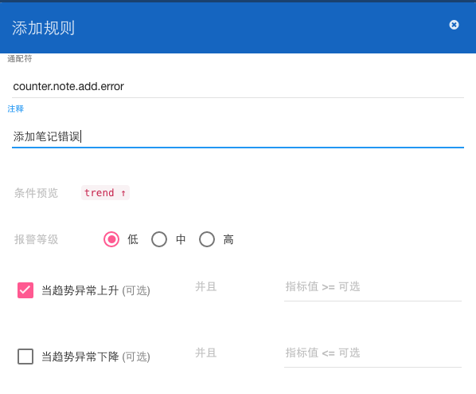
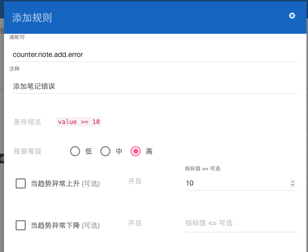
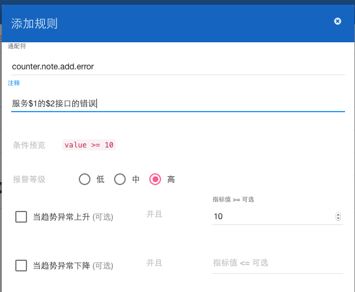
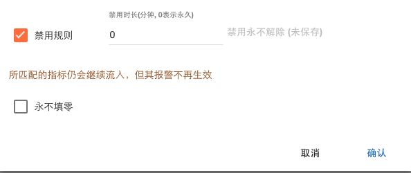
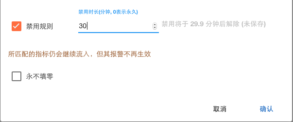

Web使用手册
===========

规则通配符
----------

规则的通配符类似传统的通配符, 和指标名字一样，按点分割，只支持 `*`, 并且星号必须代表一个单词.

```
a.b.c.d.e 命中 a.*.c.*.e
a.b.c.d.e 不命中 a.*
```

规则情况
--------

```
[ ] 当趋势异常上升 并且 指标值 >= ___
或者
[ ] 当趋势异常下降 并且 指标值 <= ___
```

1. `当趋势异常上升` => `当指标趋势异常地上升时告警`
2. `当趋势异常下降` => `当指标趋势异常地下降时告警`
3. `当指标数值>=X` => `当指标数值大于X时告警`
4. `当指标数值<=X` => `当指标数值小于X时告警`
5. `当指标异常上升 && 指标数值>=X` => `当指标趋势异常地上升到X以上时告警`
6. `当指标异常下降 && 指标数值<=X` => `当指标趋势异常地下降到X以下时告警`
7. `当指标异常上升 || 当指标异常地下降 ` => `当指标趋势异常地上升或下降时告警`
9. 以及更多组合...

*设固定阈值为0意味着该规则和该阈值没有关系*.

对时长类指标设置规则的例子
--------------------------

对于时长类指标我们一般只关心其上升趋势，下面的例子表示：当`note.add`耗时异常地
上升时告警.


对频次类指标设置规则的例子
--------------------------

对于频次类指标我们一般关心其上升和下降趋势，下面的例子表示：当`note.add`调用次数异常地
上升或者下降时告警.


对计数类指标设置规则的例子
--------------------------

对于错误类计数指标我们一般只关心其上升趋势，下面的例子表示: 当`note.add`错误个数异常地
上升时告警.



硬性阈值规则的例子
------------------

有时我们可能需要硬性阈值而不是动态分析趋势，下面的例子表示: 当`note.add`错误个数超过10的
时候告警.



规则注释变量匹配的例子
----------------------

每条规则必须添加一条注释，banshee支持对规则注释进行变量匹配, 例子:

```
规则通配符: counter.*.*.error
规则注释: 服务$1的$2接口的错误
命中指标: counter.note.add.error
告警消息: 服务note的add接口的错误
```



禁用规则例子
------------

命中禁用规则的指标仍然会继续流入和分析但是该规则的告警消息不会发出.

以下的示例为永久禁用规则:



以下的示例为暂时禁用规则，规则会在一定时间后自动解除禁用:



全局消息接收人
--------------

全局接收消息的接收人会接收所有项目的告警消息.


项目告警消息免打扰
------------------

默认的，配置文件中约定的免打扰时段是每天的凌晨0点到6点，以下的例子为自定义项目的免打扰时段:


